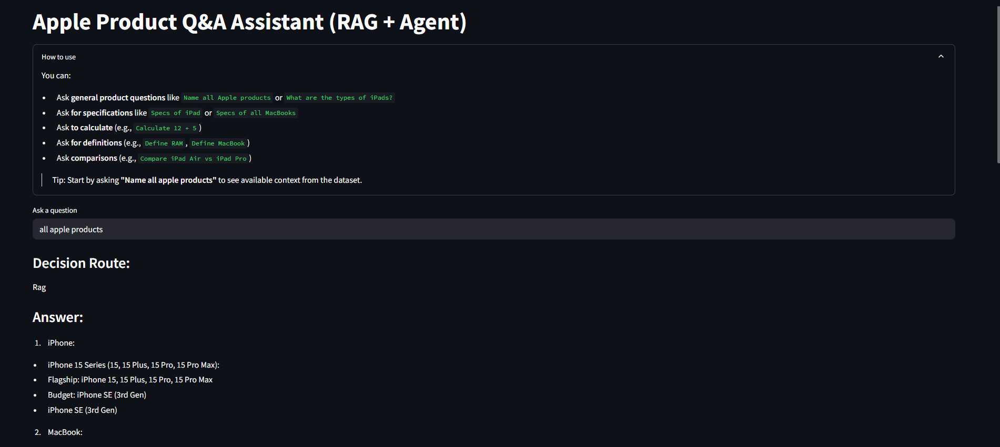
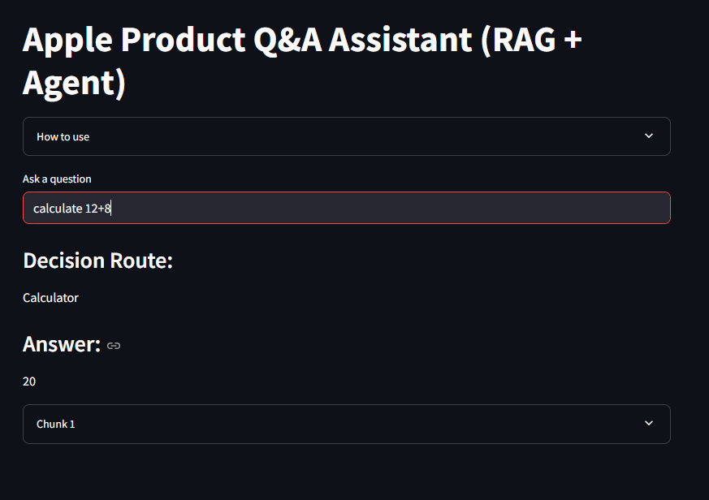
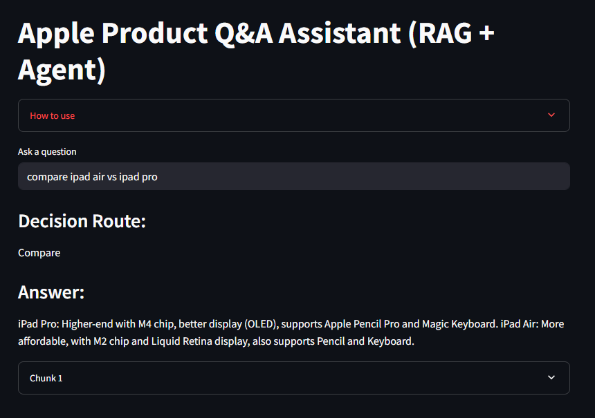

# Apple Product Q&A Assistant (RAG + Agent)

This Streamlit app is an intelligent assistant for answering questions about Apple products. It combines Retrieval-Augmented Generation (RAG) with rule-based agent routing for calculators, definitions, and product comparisons.

---

## Features

- Ask **general questions** like `Name all Apple products`
- Ask **product-specific specs** like `Specs of iPad Pro`
- Use **calculator** with queries like `Calculate 12 + 5`
- Ask for **definitions** like `Define RAM`
- Ask for **comparisons** like `Compare iPad Air vs iPad Pro`
- Uses a local **TinyLlama** model for text generation
- FAISS-powered vector search from local documents

---

## Sample Outputs

### 1. General Question  
**Query:** `Name all apple products`  : It gives a list of different porducts along with the different models available for the product like iphone and its models, mackbooks, apple watches etc.


---

### 2. Product-Specific Specs  
**Query:** `Specs of iPad Pro 2024`  


---

### 3. Calculator  
**Query:** `Calculate 15 * 3`  


---

### 4. Dictionary Definition  
**Query:** `Define M4`  


---

### 5. Product Comparison  
**Query:** `Compare iPad Pro vs iPad Air`  


---

## How to Run Locally

### 1. Clone the repository

```bash
git clone https://github.com/your-username/apple-rag-agent.git
cd apple-rag-agent
```

### 2. Install dependencies 

```bash
pip install -r requirements.txt
```

### 3. Run the app

```bash
streamlit run app.py
```

## Project structure 

```bash
├── app.py               # Streamlit frontend
├── agent.py             # Main decision router
├── llm_chain.py         # Handles RAG prompts and LLM generation
├── retriever.py         # Loads FAISS retriever
├── tools.py             # Calculator, define, compare agents
├── doc_loader.py        # Loads and chunks documents
├── requirements.txt     # Python dependencies
├── vector_store/        # FAISS index (auto-created)
├── Docs/                # Text documents for RAG
└── images/              # Screenshots of outputs
```

## Notes 
- The app uses TinyLlama-1.1B-Chat-v1.0
- Works fully offline once vector store is created
- Ideal for building product-specific knowledge assistants
- You can see the retrieved document context and top 3 chunks used to generate each answer
- You can also see the decision route it followed whether it was rag, calculator, dictionary or comparator.

## Future Improvements 
- Add PDF/HTML loader support
- Extend toolset with price lookup, timeline, etc.
- Switch to a larger LLM for richer responses

